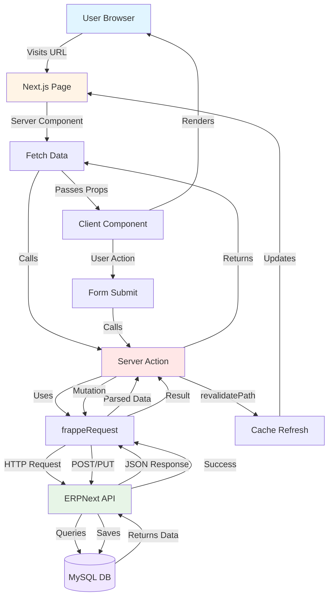

# Nexus ERP - Visual Architecture Guide

## 🎨 Component Hierarchy

```
📦 Nexus ERP Application
│
├─ 🌐 Next.js Frontend (localhost:3000)
│  │
│  ├─ 📄 Server Components (page.tsx files)
│  │  │
│  │  ├─ Responsibilities:
│  │  │  ✅ Fetch data from ERPNext
│  │  │  ✅ Pass props to Client Components
│  │  │  ✅ Render initial HTML on server
│  │  │  ❌ NO browser APIs (useState, onClick)
│  │  │
│  │  └─ Examples:
│  │     • app/(main)/dashboard/page.tsx
│  │     • app/(main)/invoices/page.tsx
│  │     • app/(main)/crm/page.tsx
│  │
│  ├─ 🎯 Client Components (components/*.tsx with 'use client')
│  │  │
│  │  ├─ Responsibilities:
│  │  │  ✅ Handle user interactions
│  │  │  ✅ Manage React state
│  │  │  ✅ Render dynamic UI
│  │  │  ✅ Call Server Actions
│  │  │
│  │  └─ Examples:
│  │     • components/crm/kanban-board.tsx (Drag & drop)
│  │     • components/invoices/create-invoice-sheet.tsx (Forms)
│  │     • components/fleet/booking-dialog.tsx (Modals)
│  │
│  └─ ⚡ Server Actions (app/actions/*.ts with 'use server')
│     │
│     ├─ Responsibilities:
│     │  ✅ Bridge between UI and ERPNext
│     │  ✅ Keep API secrets secure
│     │  ✅ Transform data formats
│     │  ✅ Handle errors gracefully
│     │
│     └─ Examples:
│        • app/actions/invoices.ts → getInvoices(), createInvoice()
│        • app/actions/crm.ts → getLeads(), updateLead()
│        • app/actions/fleet.ts → getVehicles(), createBooking()
│
├─ 🔌 API Client (app/lib/api.ts)
│  │
│  ├─ frappeRequest() function:
│  │  ✅ Adds Authorization header (API Key/Secret)
│  │  ✅ Handles GET vs POST body logic
│  │  ✅ Parses Frappe error messages
│  │  ✅ Manages caching strategy
│  │
│  └─ Configuration:
│     • Base URL: process.env.ERP_NEXT_URL
│     • Auth: token ${API_KEY}:${API_SECRET}
│     • Content-Type: application/json
│
└─ 🐳 ERPNext Backend (Docker Container)
   │
   ├─ 🎯 Frappe Framework
   │  ├─ REST API Endpoints
   │  │  • /api/method/frappe.client.get_list
   │  │  • /api/method/frappe.client.insert
   │  │  • /api/resource/Sales Invoice/{id}
   │  │
   │  ├─ Business Logic Layer
   │  │  • Tax calculations
   │  │  • Workflow validations
   │  │  • Permission checks
   │  │  • Automated triggers
   │  │
   │  └─ DocTypes (Data Models)
   │     • Sales Invoice
   │     • Customer
   │     • Item
   │     • Lead
   │     • Vehicle (Custom)
   │
   └─ 💾 MySQL Database
      └─ Persistent storage for all ERP data
```

---

## 🔄 Request Flow Examples

### Example 1: Viewing Invoice List

```
1. User visits: http://localhost:3000/invoices

2. Next.js Router matches: app/(main)/invoices/page.tsx

3. Server Component executes on server:
   ┌─────────────────────────────────────────┐
   │ export default async function Page() {  │
   │   const invoices = await getInvoices()  │ ← Server Action call
   │   return <InvoiceList invoices={...} /> │
   │ }                                        │
   └─────────────────────────────────────────┘

4. Server Action (app/actions/invoices.ts):
   ┌─────────────────────────────────────────┐
   │ export async function getInvoices() {   │
   │   return await frappeRequest(           │ ← API client call
   │     'frappe.client.get_list',           │
   │     'GET',                               │
   │     { doctype: 'Sales Invoice' }        │
   │   )                                      │
   │ }                                        │
   └─────────────────────────────────────────┘

5. API Client (app/lib/api.ts):
   ┌─────────────────────────────────────────┐
   │ const url = BASE_URL +                  │
   │   '/api/method/frappe.client.get_list'  │
   │                                          │
   │ fetch(url, {                             │
   │   headers: {                             │
   │     Authorization: 'token API:SECRET'   │ ← Auth header
   │   }                                      │
   │ })                                       │
   └─────────────────────────────────────────┘

6. ERPNext processes request:
   • Validates API credentials
   • Checks user permissions
   • Queries MySQL database
   • Returns JSON array of invoices

7. Response flows back:
   ERPNext → frappeRequest → getInvoices() → Page Component

8. Server Component renders HTML with data

9. Browser receives fully rendered page (instant!)
```

---

### Example 2: Creating New Invoice

```
1. User fills form and clicks "Submit"

2. Client Component event handler:
   ┌─────────────────────────────────────────┐
   │ 'use client'                             │
   │                                          │
   │ async function handleSubmit(data) {     │
   │   const result = await createInvoice(   │ ← Server Action call
   │     formData                             │
   │   )                                      │
   │   if (result.success) {                 │
   │     router.push('/invoices')            │
   │   }                                      │
   │ }                                        │
   └─────────────────────────────────────────┘

3. Server Action (app/actions/invoices.ts):
   ┌─────────────────────────────────────────┐
   │ 'use server'                             │
   │                                          │
   │ export async function createInvoice(    │
   │   data: FormData                         │
   │ ) {                                      │
   │   // Transform to ERPNext format        │
   │   const doc = {                          │
   │     doctype: 'Sales Invoice',           │
   │     customer: data.customer,            │
   │     items: [...],                        │
   │     // ...                                │
   │   }                                      │
   │                                          │
   │   const result = await frappeRequest(   │
   │     'frappe.client.insert',             │
   │     'POST',                              │
   │     { doc }                              │
   │   )                                      │
   │                                          │
   │   revalidatePath('/invoices') ←──────────┐ Cache refresh
   │   return result                          │
   │ }                                        │
   └─────────────────────────────────────────┘

4. API Client sends POST request to ERPNext

5. ERPNext validates and saves:
   • Runs validation scripts
   • Calculates taxes automatically
   • Generates invoice number (INV-001)
   • Saves to MySQL
   • Creates audit trail

6. Response returns with new invoice data

7. revalidatePath() clears Next.js cache

8. Router navigates to /invoices

9. Page re-fetches data (now includes new invoice!)
```

---

## 📂 File Organization Pattern

```
Feature: Invoice Management
│
├─ 📄 Page (Server Component)
│  └─ app/(main)/invoices/page.tsx
│     Role: Fetch invoice list, display layout
│
├─ ⚡ Server Actions (Backend Logic)
│  └─ app/actions/invoices.ts
│     Functions:
│     • getInvoices() → Read
│     • createInvoice() → Create
│     • updateInvoice() → Update
│     • deleteInvoice() → Delete
│     • submitInvoice() → Workflow
│
└─ 🎯 Client Components (Interactive UI)
   └─ components/invoices/
      ├─ invoice-table.tsx (List with sorting/filtering)
      ├─ create-invoice-sheet.tsx (Form with validation)
      ├─ invoice-actions.tsx (Submit/Cancel buttons)
      ├─ customer-search.tsx (Autocomplete search)
      └─ item-search.tsx (Line item picker)
```

---

## 🔐 Security Layers

```
┌────────────────────────────────────────────────┐
│ LAYER 1: Environment Variables                 │
│ • API keys stored in .env.local (gitignored)  │
│ • Never exposed to browser                     │
│ • Loaded only on server side                   │
└────────────────────────────────────────────────┘
                  ↓
┌────────────────────────────────────────────────┐
│ LAYER 2: Server Actions                        │
│ • Run exclusively on Next.js server            │
│ • Client can only call functions (not access   │
│   implementation)                               │
│ • Validated inputs before API calls            │
└────────────────────────────────────────────────┘
                  ↓
┌────────────────────────────────────────────────┐
│ LAYER 3: API Client (frappeRequest)           │
│ • Adds Authorization header automatically       │
│ • Rate limiting (if configured)                │
│ • Error sanitization (no sensitive data leaks) │
└────────────────────────────────────────────────┘
                  ↓
┌────────────────────────────────────────────────┐
│ LAYER 4: ERPNext Backend                       │
│ • Validates API credentials                    │
│ • Checks user permissions per DocType          │
│ • Role-based access control (RBAC)            │
│ • Field-level permissions                      │
└────────────────────────────────────────────────┘
                  ↓
┌────────────────────────────────────────────────┐
│ LAYER 5: Database                              │
│ • MySQL access restricted to Frappe only       │
│ • No direct database connections from Next.js  │
│ • Audit logs for all changes                   │
└────────────────────────────────────────────────┘
```

---

## 🎯 Routing Structure

```
URL Structure                    File Path
─────────────────────────────────────────────────────────────
/                               app/page.tsx
/login                          app/login/page.tsx

┌─ Protected Routes (with sidebar) ─────────────────────────
│ Layout: app/(main)/layout.tsx
│
├─ /dashboard                   app/(main)/dashboard/page.tsx
├─ /invoices                    app/(main)/invoices/page.tsx
├─ /invoices/new                app/(main)/invoices/new/page.tsx
├─ /invoices/INV-001            app/(main)/invoices/[id]/page.tsx
│
├─ /crm                         app/(main)/crm/page.tsx
├─ /crm/LEAD-001                app/(main)/crm/[id]/page.tsx
├─ /crm/new                     app/(main)/crm/new/page.tsx
│
├─ /fleet                       app/(main)/fleet/page.tsx
├─ /fleet/VEH-001               app/(main)/fleet/[id]/page.tsx
└─ /fleet/new                   app/(main)/fleet/new/page.tsx

┌─ Print Routes (no sidebar) ───────────────────────────────
│ Layout: None (standalone pages)
│
└─ /print/invoice/INV-001       app/print/invoice/[id]/page.tsx
```

---

## 💾 Data Flow Patterns

### Pattern 1: Read (GET)

```
┌────────────┐     ┌───────────────┐     ┌──────────┐     ┌─────────┐
│   Page     │────▶│ Server Action │────▶│   API    │────▶│ ERPNext │
│ (Server)   │     │  getInvoices  │     │  Client  │     │   GET   │
└────────────┘     └───────────────┘     └──────────┘     └─────────┘
      ▲                    ▲                    ▲               │
      │                    │                    │               │
      │                    │                    │               ▼
      │                    │                    │          ┌─────────┐
      │                    │                    └──────────│  JSON   │
      │                    │                               │ Response│
      │                    └───────────────────────────────┤  Data   │
      └────────────────────────────────────────────────────┴─────────┘
                        Passes as props
```

### Pattern 2: Create (POST)

```
┌────────────┐     ┌───────────────┐     ┌──────────┐     ┌─────────┐
│  Client    │────▶│ Server Action │────▶│   API    │────▶│ ERPNext │
│ Component  │     │ createInvoice │     │  Client  │     │  POST   │
│  (Form)    │     │               │     │          │     │         │
└────────────┘     │  revalidate   │     └──────────┘     └─────────┘
      ▲            │  Path()       │           │               │
      │            └───────────────┘           │               │
      │                    │                   │               ▼
      │                    │                   │          ┌─────────┐
      │                    │                   │          │  Saves  │
      │                    │                   │          │   to    │
      │                    │                   │          │  MySQL  │
      │                    │                   │          └─────────┘
      │                    │                   │               │
      │                    ▼                   ▼               │
      │            ┌──────────────┐       ┌─────────┐         │
      │            │ Clear Cache  │       │ Success │◀────────┘
      │            └──────────────┘       │ Response│
      │                    │               └─────────┘
      │                    │                    │
      └────────────────────┴────────────────────┘
                  Updates UI with fresh data
```

---

## 🧩 Component Communication Patterns

### ❌ Anti-Pattern (Don't do this!)
```typescript
// components/invoice-form.tsx
'use client'

import { frappeRequest } from '@/app/lib/api' // ❌ Can't import server code!

export function InvoiceForm() {
  async function handleSubmit() {
    const result = await frappeRequest(...) // ❌ Won't work in browser!
  }
}
```

### ✅ Correct Pattern
```typescript
// components/invoice-form.tsx
'use client'

import { createInvoice } from '@/app/actions/invoices' // ✅ Server Action

export function InvoiceForm() {
  async function handleSubmit() {
    const result = await createInvoice(data) // ✅ Works perfectly!
  }
}
```

---

## 📊 Performance Optimization Strategies

```
Strategy 1: Server Components by Default
────────────────────────────────────────
┌─────────────────────────────────────┐
│ Server Component (Free!)            │
│ • No JavaScript to browser          │
│ • Instant data access               │
│ • Smaller bundle size               │
└─────────────────────────────────────┘

Strategy 2: Parallel Data Fetching
────────────────────────────────────────
const [customers, items, taxes] = await Promise.all([
  getCustomers(),
  getItems(),
  getTaxTemplates(),
])
// 3x faster than sequential! ⚡

Strategy 3: Selective Hydration
────────────────────────────────────────
Only mark interactive parts as 'use client':
✅ Kanban drag & drop
✅ Form inputs
✅ Modals/dialogs
❌ Static tables
❌ Text content
❌ Charts (use SSR-friendly libraries)

Strategy 4: Smart Caching
────────────────────────────────────────
Real-time data:    cache: 'no-store'
Static config:     cache: 'force-cache'
After mutations:   revalidatePath('/page')
```

---

## 🎓 Learning Resources

1. **Next.js App Router:**
   https://nextjs.org/docs/app

2. **Server Actions:**
   https://nextjs.org/docs/app/building-your-application/data-fetching/server-actions

3. **ERPNext API:**
   https://frappeframework.com/docs/user/en/api

4. **React Server Components:**
   https://react.dev/reference/rsc/server-components

---

**This visual guide complements the written documentation in ARCHITECTURE.md**
```
